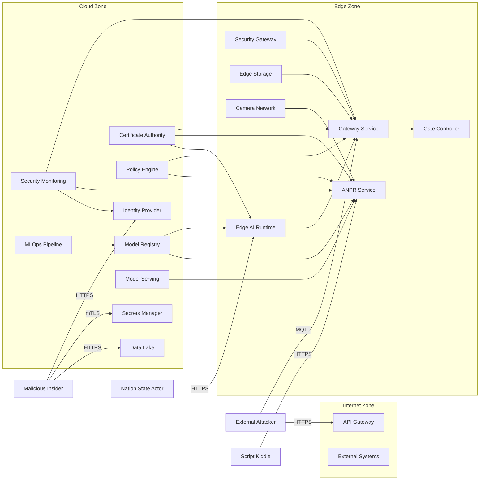

# DSL Security Views

This diagram is derived from the actual Structurizr model in [`workspace.dsl`](../model/workspace.dsl), especially:

- threat actors and containers at lines 15-301
- attack-path relationships at lines 617-642
- deployment at lines 659-770
- views at lines 775-850

## Reading Notes

- The DSL’s highest-risk attack path is the one touching `Gateway Service` at the edge.
- The DSL’s clearest AI-specific threat path is `Nation State Actor -> Edge AI Runtime`.
- The DSL’s strongest insider-threat focus is identity, secrets, and data-lake compromise.
